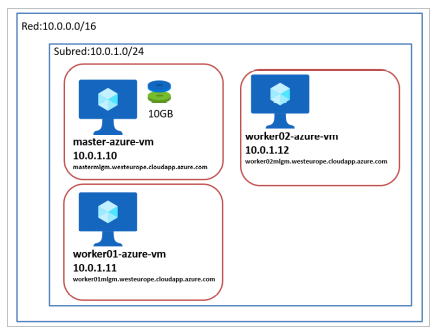

#  Objetivo del projecto

El objetivo de este proyecto es permitir a cualquier usuario familiarizarse con el despliegue de 
una aplicación (JupyterNotebook) de forma automatizada en el entorno cloud de Azure empleando para ello: 
- **Terraform**, como herramienta de código para el despliegue de infraestructura y
- **Ansible** como software de gestión de configuración y despliegue de aplicaciones y 

# Terraform
## Arquitectura a desplegar en Terraform



##  Comandos para el despliegue de la arquitectura de Terraform en Azure

1. Clonamos este repositorio y accedemos a la carperta terraform
```console
XXX@Azure: git clone https://github.com/mlgallego/CasoPractico2 
XXX@Azure: cd CasoPractico2/terraform
```
2. Genere un archivo credentials.tf y guardelo en la carpeta terraform (permite autenticar Terraform en Azure) 
```console
XXX@Azure: mv credentials.tf CasoPractico2/terraform/credentials.tf 
```

3. Inicializamos un directorio para que Terraform se ejecute en él
```console
XXX@Azure: terraform init 
```

4. Generamos un plan de Terraform 
```console
XXX@Azure: terraform plan 
```

5. Desplegamos la infraestructura de Terraform y la visualizamos
```console
XXX@Azure: terraform apply 
XXX@Azure: terraform show 
```

6. Si queremos destruir la infraestructura 
```console
XXX@Azure: terraform destroy 
```

# Ansible
##  Comandos para el despliegue de kubernetes empleando Ansible
1. Si es necesario modificamos el archivo hosts.azure

2. Desplegamos el playbook setup.yaml
```console
XXX@Azure ~/CasoPractico2/ansible/: ansible-playbook –i hosts.azure setup.yaml
```
> **_NOTE:_** Deberemos introducir “yes” tantas veces como maquinas tenga nuestro entorno, por defecto 3 veces

3. Desplegamos el playbook start_nfs.yaml
```console
XXX@Azure ~/CasoPractico2/ansible/: ansible-playbook –i hosts.azure start_nfs.yaml
```
4. Desplegamos el playbook start_kube.yaml
```console
XXX@Azure ~/CasoPractico2/ansible/: ansible-playbook –i hosts.azure start_kube.yaml
```

# Despliegue de la aplicación JupyterNotebook
```console
XXX@Azure ~/CasoPractico2/ansible/: ansible-playbook –i hosts.azure deploy_first_app.yaml
```
> **_NOTE:_** Para acceder a la aplicación, debemos incluir tu IP pública en Azure para permitir el tráfico

Volevemos a conectarnos por ssh 
```console
XXX@Azure ~/CasoPractico2/ansible/: ssh adminUsername@mastermlgm.westeurope.cloudapp.azure.com
```
ejecutamos 
```console
adminUsername@master-azure-vm]: sudo kubectl get svc --namespace=haproxy-controller
```
> **_NOTE:_** Obtenemos el puerto

```console
mastermlgm.westeurope.cloudapp.azure.com:[PUERTO_OBTENIDO]
```

> **_NOTE:_** token/password para poder acceder al JupyterNotebook es **practica2**
